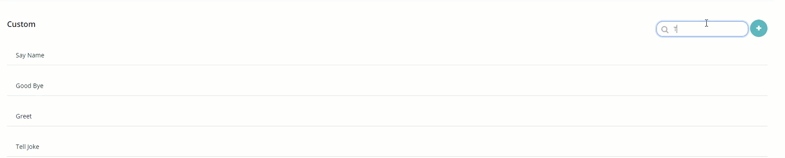

## Project Dashboard

Once you log on to the Cogniassist platform, it directs you to a project dashboard in which you can create a new bot or look through the existing bot configurations.

***Note*** - The existing project displays the current status, deployed date and time and the instance details of the bot.

| Project status                                               | Description                                                  |
| :----------------------------------------------------------- | :----------------------------------------------------------- |
|  | Bot is online                                                |
|  | Project is stopped                                           |
|  | As soon as the project is created, the status will be **Not Available**. |

You can edit or delete the existing project using the settings icon  based on the access provided to you. Example, only an **Admin** user can delete the existing project.

### Create New Project

Click the **Create New Project** icon , a pop-up window will open for you to name your bot, specify its description, language and user settings.

#### Add Languages	

You can select different languages to build a flexible multi-language conversational bot.

#### Add Users

You can add multiple users to add, edit or view the project details.

***Note*** - 

- The project **Admins** have full access and control over each aspect of the project.
- The **User** has the access to edit the project but not allowed to launch it.
- The **Spectator** can only view or chat with the bot.

Once you create a project, click the project name, it directs you to a bot building platform. 

***Note*** - To modify or view the existing projects, click a project name and it displays the respective configuration settings as shown above.